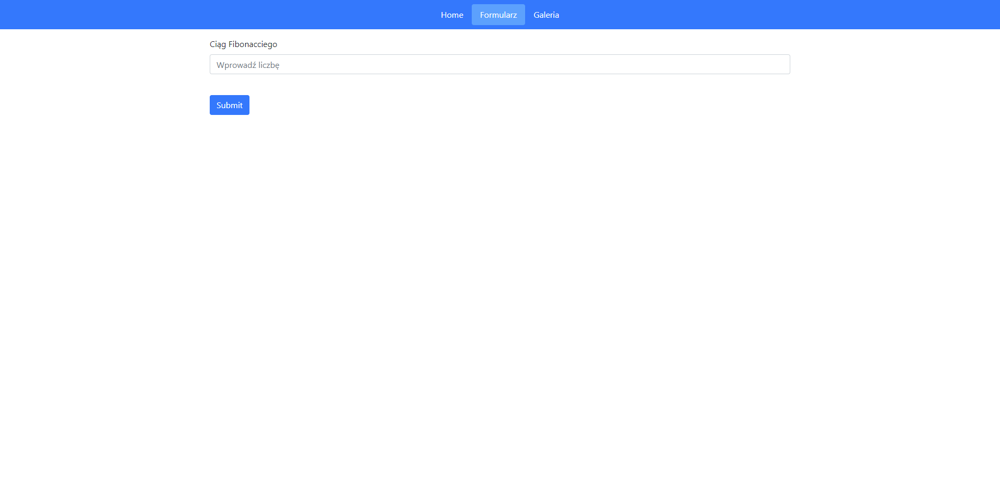
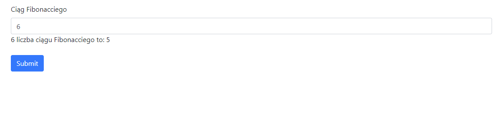
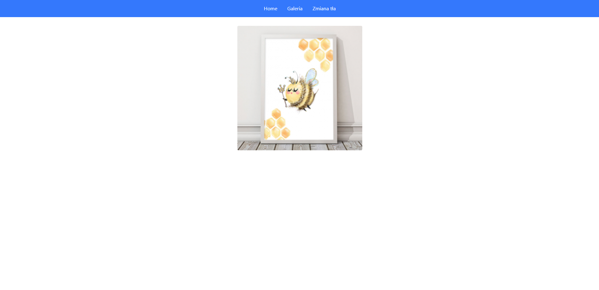
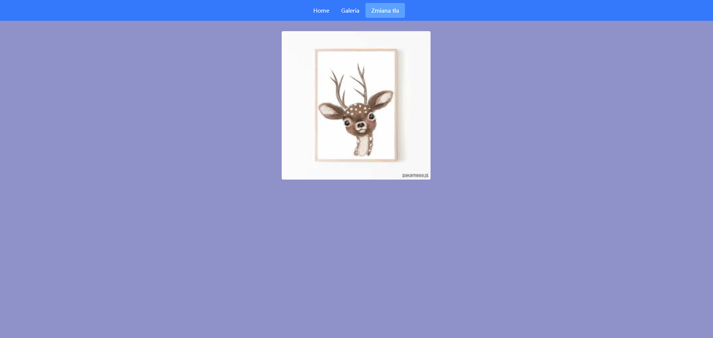

# projektowanie-serwisow-www-Lipski-LAB2-185ic

### Na pierwszym obrazku wita nas piękna animacja ładowania

### Po najechaniu na dowolny przycisk na pasku nawigacyjnym mozna zauwarzyć jak pięknię zmienia się ich tło

### Po naciśnięciu na przycisk "Formularz" pojawia się formularz, po ponownym jego naciśnięciu formularz znika.

### Po wprowadzeniu dowolnej liczby do formularza, i wciśnięciu przycisku submit, pojawia się n liczba ciągu Fibonacciego

### W zakładce galeria.index co 3 sekundy zmienia się obrazek na środku strony

### Przycisk "zmień tło" zmienia tło na losowy kolor

:clap::clap::clap: Dziękuję za uwagę :clap::clap::clap:
