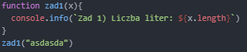
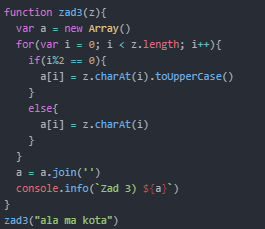
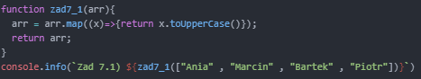
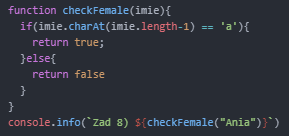

# projektowanie-serwisow-www-Lipski-LAB3-185ic

### Wynik zadań od 1 do 9

### Kod zadania 1

### Kod zadania 2

### Kod zadania 3

### Kod zadania 4

### Kod zadania 5

### Kod zadania 6

### Kod zadania 7.1

### Kod zadania 7.2

### Kod zadania 8

### Kod zadania 9

### (Event load) Po załadowaniu strony wyświetla się alert

### (Event click) Po wciśnięciu przycisku, w paragrafie pojawia się zawartość inputa

### (Event focus) Po kliknięciu na pole input, tło zmiena kolor na żółty

### (Event blur) Po kliknięciu poza pole input, tło zmiena kolor na biały

### (Event copy) Po skopiowaniu zawartości pola input, poniżej wyświetla się skopiowany tekst

### (Event mousemove oraz mouseover) Po najedzaniu na div wyświetla się tekst, oraz współrzędne gdzie aktualnie wskazuje kursor myszki

### (Event mouseout) Po zjechaniu z diva wyświetla się inny tekst

### (Event resize) Podczas zmiany rozmiaru okna przeglądarki, zmienia się równierz położenie diva

### (Event wheel) Po zakręceniu kułkiem myszy nad divem, zwiększa się rozmiar czcionki

### Usunięcie Eventu mousemove

