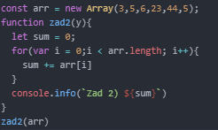
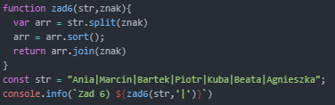

# projektowanie-serwisow-www-Lipski-Lab4-185ic

### Okno logowania

### Kod pliku login.js

### Okno gry

### Po zbliżeniu się do przeciwnika, można z nim walczyć klikając na niego lpm

### Przebieg walki, na razie gracz ma do wyboru atak, lub leczenie

### Po walce stan gracza, na pasku informacyjnym jest uaktualniany

  

### Kod pliku objects.js

### Kod pliku canvas.js (1/4)

### Kod pliku canvas.js (2/4)

### Kod pliku canvas.js (3/4)

### Kod pliku canvas.js (4/4)

