# projektowanie-serwisow-www-Lipski-Lab5-185ic

### Zawartość pliku data.json

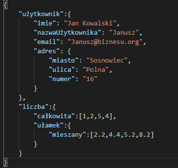

###  Zad 1 funkcja zwrotna (callback)

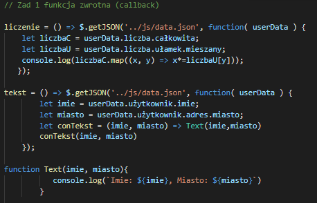

### 

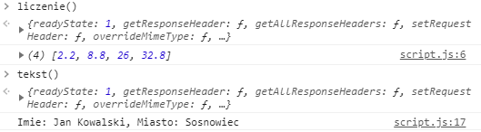

### Zad 2 obiekt Promise

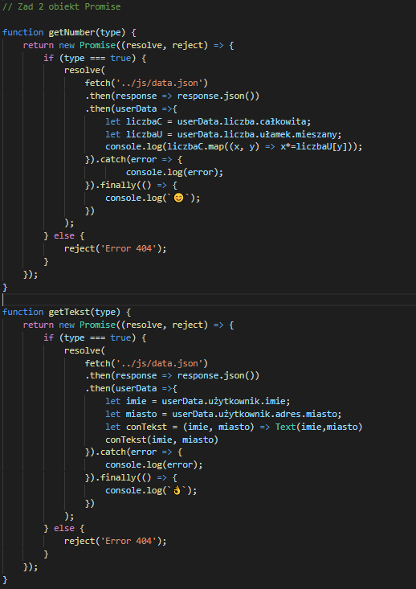

### 

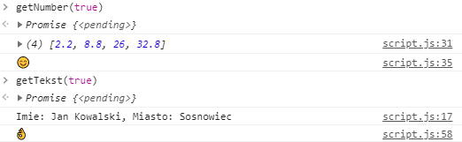

### Zad 3 async/await

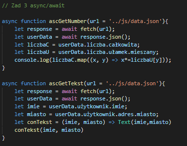

### 

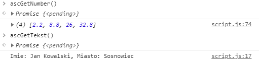

### Zad 4 Zapytania AJAX

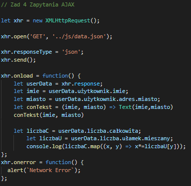

### 

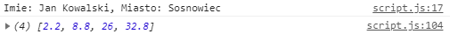

### Zad 5 metoda fetch

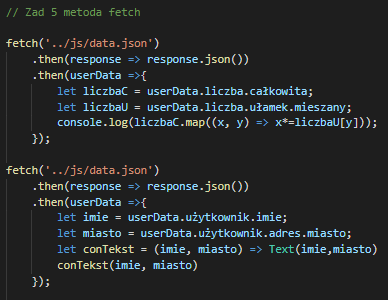

### 

### Zad 6 bibliotexa axios

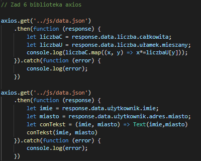

### 

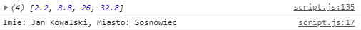

python3 -m http.server 8000