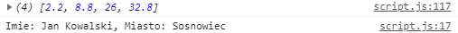

# projektowanie-serwisow-www-Lipski-Lab5-185ic

### Zawartość pliku data.json

###  Zad 1 funkcja zwrotna (callback)

### 

### Zad 2 obiekt Promise

### 

### Zad 3 async/await

### 

### Zad 4 Zapytania AJAX

### 

### Zad 5 metoda fetch

### 

### Zad 6 bibliotexa axios

### 

python3 -m http.server 8000