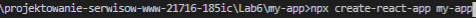
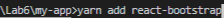
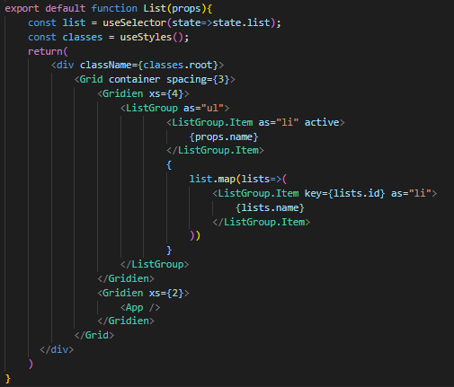
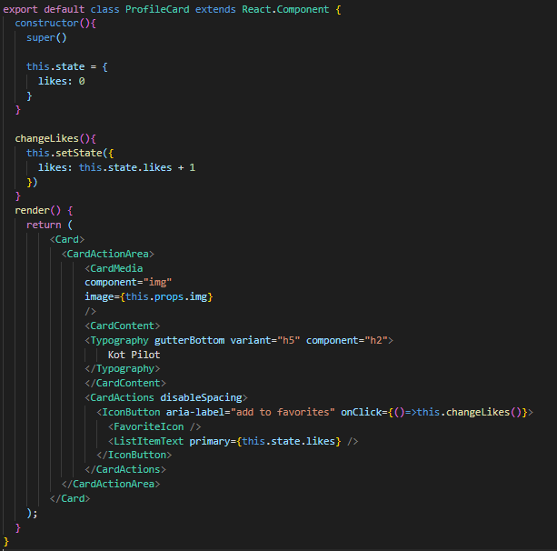
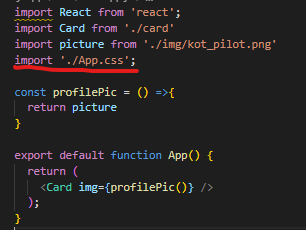
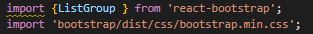
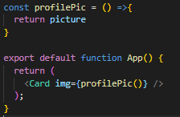
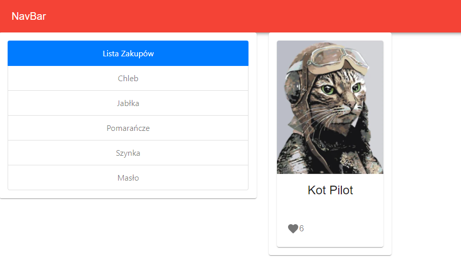

# Projektowanie serwisow www 21716 Lab6

### tworzenie aplikacji za pomocą modułu ‘create-react-app’

### instalacja 'react-bootstrap'

### Komponent funkcyjny, użycie funkcja map(), props oraz atrybutu key 
#### komponent nadrzędny 'ul' i komponenty potomne 'li'

### Komponent klasowy, użycie state

###  Dodanie pliku .css

### Użycie react-bootstrap

### Wysłanie funkcji za pomocą props

### Wygląd strony
#### Po kliknięciu :heart: licznik zwiększa się o jeden

