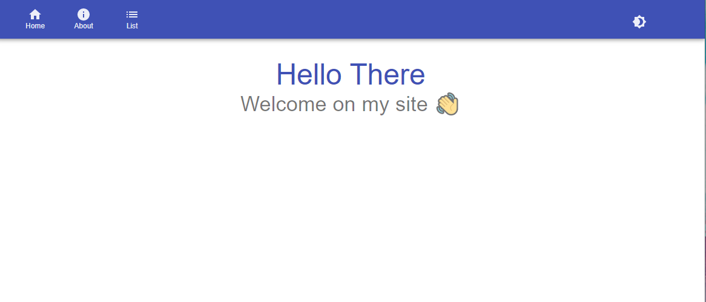
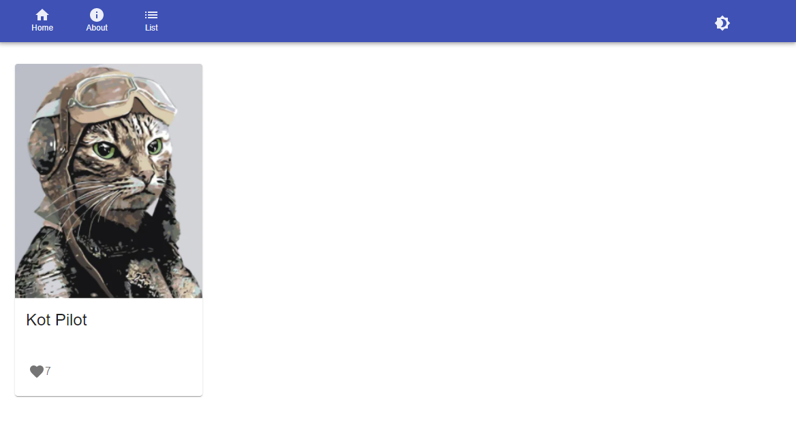
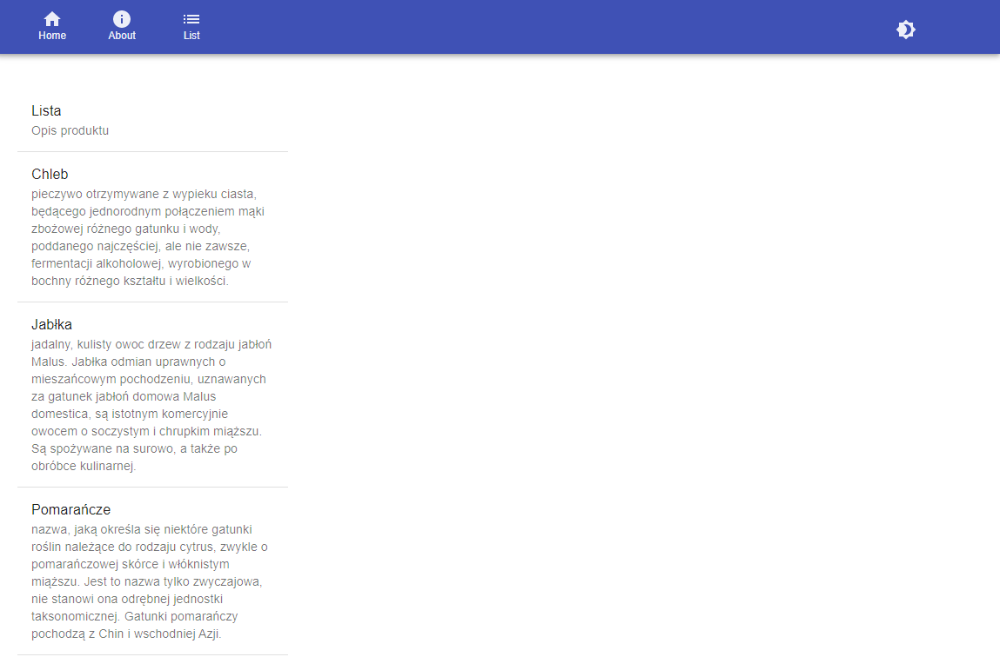
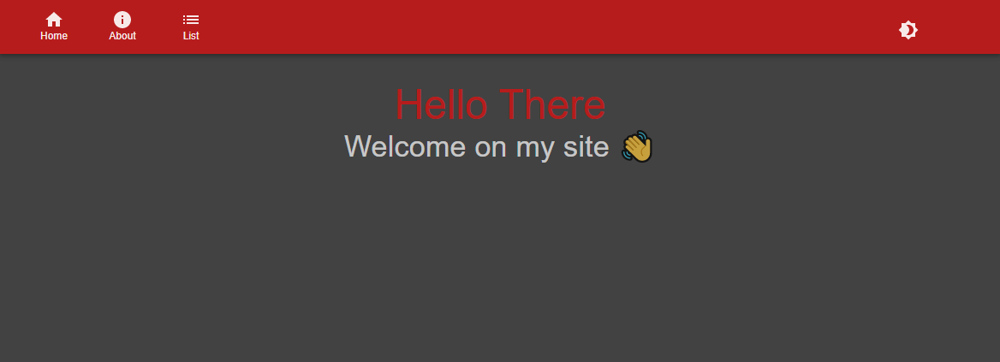

# Projektowanie serwisow WWW Lab7

### tworzenie aplikacji za pomocą modułu ‘create-react-app’

### instalacja `yarn add @material-ui/core @material-ui/icons @material-ui/lab @material-ui/styles` 

### `react-dom react-router-dom react react-redux`

### Strona startowa wyświetla powitanie

### Strona about wyświetla kartę z kotem pilotem

### Strona list wyświetla liste produktów z krótkim opisem

### Przycisk po prawej stronie na pasku nawigacyjnym umożliwia zmiany stybu z jasnego na ciemny, i na odrót

