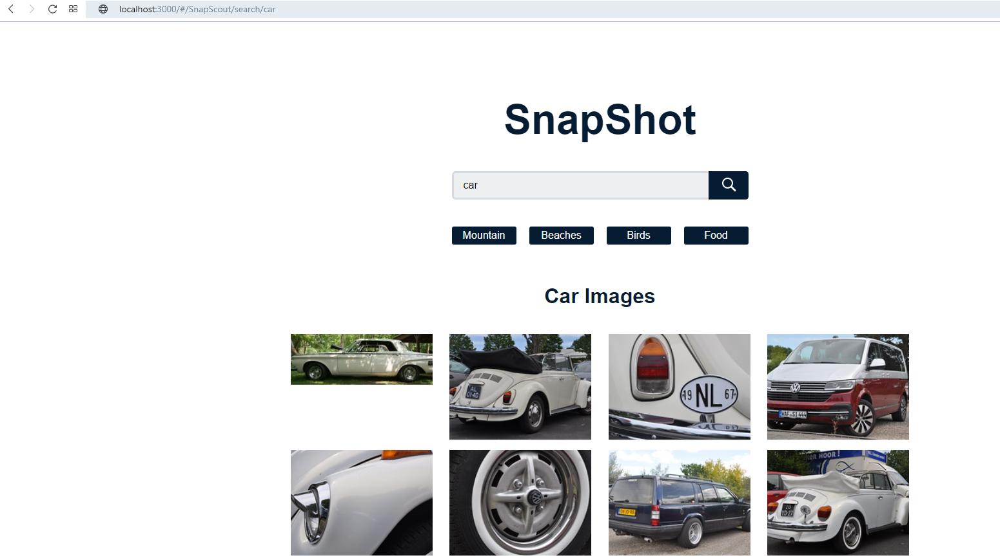
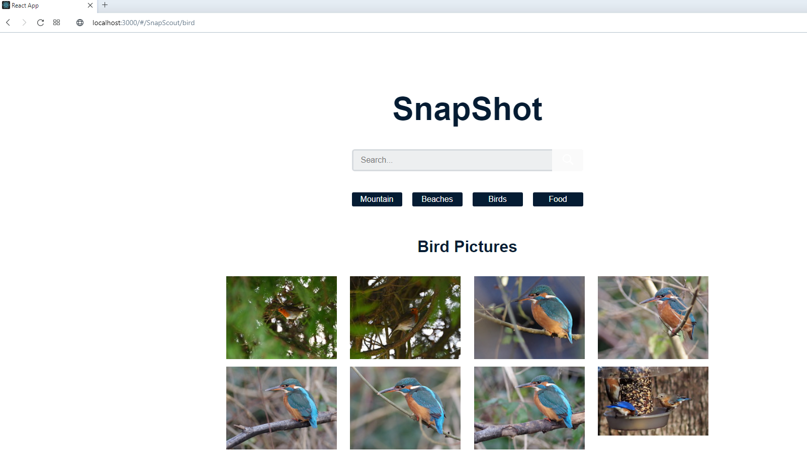

# Projektowanie serwisow WWW Lab8

### tworzenie aplikacji za pomocą modułu ‘create-react-app’

### instalacja `yarn add react-dom react-router-dom react axios` 

### W polu 'Search' można ręcznie wpisać nazwę porządanego obrazu.

### Lub wybrać jedną z czterech domyślnych opcji.

